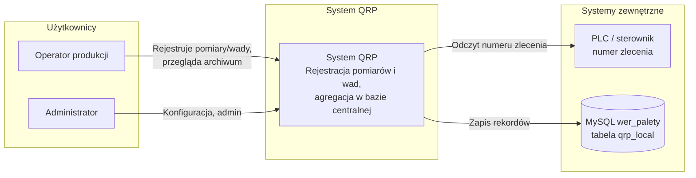
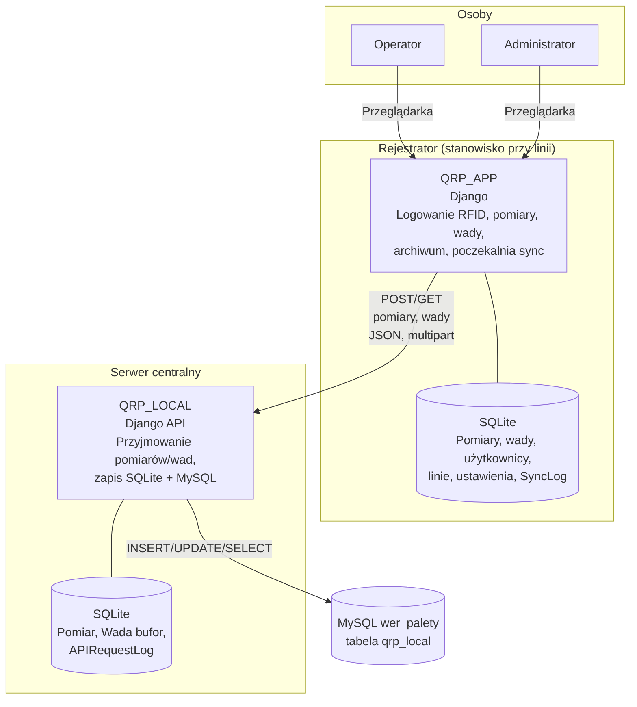

# Dokumentacja systemu QRP – rejestrator (QRP_APP) i serwer centralny (QRP_LOCAL)

Pełna dokumentacja działania obu aplikacji oraz diagramy C4 (System Context, Container).

---

## 1. Przegląd systemu

System składa się z:

- **QRP_APP (rejestrator)** – aplikacja Django uruchamiana na stanowiskach przy liniach produkcyjnych. Operatorzy logują się (RFID lub ręcznie), rejestrują pomiary i wady, przeglądają archiwum. Dane są zapisywane lokalnie w SQLite i wysyłane do serwera centralnego.
- **QRP_LOCAL (serwer centralny)** – aplikacja Django przyjmująca dane z rejestratorów przez API, zapisująca je w lokalnej bazie SQLite oraz w zewnętrznej bazie MySQL (np. `wer_palety`, tabela `qrp_local`) na potrzeby innych systemów (raporty, integracje).

Przepływ danych: **Rejestrator (SQLite) → HTTP API → QRP_LOCAL (SQLite + MySQL)**.

---

## 2. QRP_APP (rejestrator) – dokumentacja działania

### 2.1 Przeznaczenie

- Logowanie operatorów (RFID lub rejestracja z numerem KJ).
- Rejestracja **pomiarów** (linia, typ kontroli, rodzaj testu, zdjęcie, komentarz, numer zlecenia).
- Rejestracja **wad** (linia, typ kontroli, opis wady, zdjęcie, komentarz, numer zlecenia).
- Archiwum zapisów z filtrami i eksportem CSV/PDF.
- Synchronizacja z serwerem centralnym (poczekalnia, automatyczne wysyłanie w tle, weryfikacja po błędzie).

### 2.2 Technologie

- **Backend:** Django (Python)
- **Baza:** SQLite (USE_TZ=False – czas lokalny komputera)
- **Frontend:** Szablony HTML + JavaScript (fetch, formularze)

### 2.3 Główne komponenty

| Komponent | Opis |
|-----------|------|
| **views.py** | Widoki stron (logowanie, pomiar, wada, archiwum, pomoc) oraz endpointy API (pomiar, wada, sync, order-number, auto-logout). |
| **models.py** | Rejestrator, LiniaProdukcyjna, Pomiar, Wada, User/RFIDCard, TypKontroli, RodzajTestu, SystemSettings, SyncLog, AllowedIP itd. |
| **sync_service.py** | Przygotowanie payloadu i wysyłka rekordu (Pomiar/Wada) do API QRP_LOCAL; weryfikacja GET po timeout/ConnectionError. |
| **sync_scheduler.py** | Wątek daemon co N minut wysyłający niezsynchronizowane rekordy (pomiary i wady) – niezależnie od otwartej strony. |
| **csv_service.py** | Generowanie plików CSV z pomiarów (format pod zewnętrzną aplikację). |
| **apps.py** | Uruchomienie schedulera synchronizacji oraz ładowanie AllowedIP do ALLOWED_HOSTS. |
| **middleware.py** | Wybór linii po hostname/DNS, ograniczenie dostępu po AllowedIP. |

### 2.4 Endpointy (QRP_APP)

| Metoda | Ścieżka | Opis |
|--------|---------|------|
| GET | `/` | Strona logowania RFID. |
| POST | `/api/login/` | Logowanie (rfid_code). |
| POST | `/api/register/` | Rejestracja karty RFID (rfid_code, name, kj_number). |
| GET | `/api/order-number/?line_id=<id>` | Pobranie numeru zlecenia z PLC dla linii. |
| POST | `/api/measurement/` | Zapis pomiaru (formularz + opcjonalnie zdjęcie); po zapisie wywołanie `send_to_central_api(pomiar)`. |
| POST | `/api/defect/` | Zapis wady (formularz + opcjonalnie zdjęcie); po zapisie wywołanie `send_to_central_api(wada)`. |
| POST | `/logout/` | Wylogowanie (CSRF z ciasteczka). |
| GET | `/measurement/`, `/defect/`, `/archive/`, `/help/` | Strony rejestracji i archiwum. |
| GET | `/api/sync/status/` | Status ostatniej synchronizacji (dla wskaźnika w UI). |
| GET | `/api/sync/pending/` | Lista rekordów w poczekalni (nie wysłanych). |
| POST | `/api/sync/now/` | Ręczne wywołanie synchronizacji poczekalni. |
| GET | `/api/auto-logout-settings/` | Ustawienia auto-wylogowania (timeout w minutach). |

### 2.5 Synchronizacja z QRP_LOCAL

- **Kiedy:** Od razu po zapisie pomiaru/wady w widoku oraz cyklicznie ze schedulera (co `retry_interval_minutes` z SystemSettings).
- **Payload:** JSON (lub multipart z polem `data` + plik `photo`): `record_id`, `registrar_id`, `line_name`, `line_id`, `control_type`, `created_at` (czas lokalny rejestratora w ISO), oraz dla pomiaru: `test_type`/`test_type_display`/`comment`, dla wady: `defect_description`/`comment`.
- **Sukces:** Odpowiedź HTTP 2xx → rekord oznaczany jako `is_synced=True`, `synced_at=now()`.
- **Błąd (timeout/ConnectionError):** Wykonywane jest GET na `/api/measurements/<id>/` lub `/api/defects/<id>/` i dopasowanie po `(record_id, registrar_id)`; jeśli rekord jest na serwerze, lokalnie ustawiane jest `is_synced=True`.
- **Poczekalnia:** Rekordy z `is_synced=False` są wyświetlane w archiwum w sekcji „Poczekalnia” i ponawiane przez scheduler.

### 2.6 Konfiguracja (SystemSettings)

- `api_url` – bazowy URL API QRP_LOCAL (np. `http://10.11.1.1:8000/api`).
- `api_token` – token Bearer (opcjonalnie).
- `retry_interval_minutes`, `retry_batch_size` – scheduler i batch wysyłki.
- `show_sync_status`, `show_sync_column` – wyświetlanie statusu sync i kolumny „Wysłano” w archiwum.
- `auto_logout_enabled`, `auto_logout_timeout_minutes` – auto-wylogowanie po bezczynności.

### 2.7 Czas

- USE_TZ=False: w SQLite zapisywany jest czas lokalny komputera (Europe/Warsaw z ustawień). Do API wysyłane jest `created_at` w tym samym czasie (np. `2026-02-21T23:00:00`).

---

## 3. QRP_LOCAL (serwer centralny) – dokumentacja działania

### 3.1 Przeznaczenie

- Przyjmowanie pomiarów i wad z rejestratorów przez HTTP API.
- Zapis w lokalnej bazie SQLite (modele Pomiar, Wada – bufor, logi).
- Zapis w zewnętrznej bazie MySQL (tabela `qrp_local` w bazie np. `wer_palety`) w celu udostępnienia danych innym systemom.
- Weryfikacja zapisu w MySQL (odczyt po `record_id` + `registrar_id` po commit).
- Odpowiedzi 503 przy nieudanym zapisie do MySQL, aby rejestrator mógł ponowić wysyłkę.

### 3.2 Technologie

- **Backend:** Django (Python)
- **Bazy:** SQLite (domyślna, USE_TZ=False), MySQL (połączenie `external` – np. wer_palety)
- **API:** JSON, multipart/form-data (zdjęcia)

### 3.3 Główne komponenty

| Komponent | Opis |
|-----------|------|
| **api/views.py** | MeasurementAPI, DefectAPI (POST), MeasurementCheckAPI, DefectCheckAPI (GET), health_check; parsowanie `created_at`, zapis do modeli i do MySQL. |
| **api/external_db.py** | `save_to_external_db(record_type, data, photo_path)` – INSERT/UPDATE w tabeli `qrp_local`, zdjęcia jako BLOB; po commit weryfikacja SELECT; `created_at` = godzina z rejestratora (ta sama w MySQL). |
| **api/models.py** | Pomiar, Wada (record_id, registrar_id, line_name, line_id, …), SyncSettings, APIRequestLog. |
| **api/middleware.py** | Przechwytywanie błędów połączenia z bazą, zwrot 503 dla `/api/`. |

### 3.4 Endpointy (QRP_LOCAL)

| Metoda | Ścieżka | Opis |
|--------|---------|------|
| POST | `/api/measurements/` | Przyjęcie pomiaru; zapis w SQLite (Pomiar) i MySQL (qrp_local); zwrot 201 lub 503 przy błędzie MySQL. |
| POST | `/api/defects/` | Przyjęcie wady; zapis w SQLite (Wada) i MySQL (qrp_local); zwrot 201 lub 503. |
| GET | `/api/measurements/<record_id>/` | Lista pomiarów z record_id ≤ podanego (SQLite + MySQL), dopasowanie po (record_id, registrar_id). |
| GET | `/api/defects/<record_id>/` | Lista wad z record_id ≤ podanego (SQLite + MySQL). |
| GET | `/api/health/` | Health check (status, timestamp). |

### 3.5 Zapis do MySQL (qrp_local)

- **Tabela:** `qrp_local` (baza zewnętrzna, np. wer_palety).
- **Kolumny:** record_type, record_id, registrar_id, line_name, line_id, user, order_number, control_type, test_type/test_type_display lub defect_description, comment, photo (BLOB), created_at, received_at.
- **created_at:** Dokładnie ta sama godzina co na rejestratorze (naiwny czas lokalny); bez konwersji UTC.
- **received_at:** Ustawiane na tę samą wartość co created_at (kolumna wypełniona, weryfikacja sukcesu przez SELECT po zapisie).
- **Weryfikacja:** Po `commit()` wykonywany jest `SELECT id FROM qrp_local WHERE record_id=? AND record_type=? AND registrar_id=?`; jeśli brak wiersza, funkcja zwraca None (API zwraca 503).

### 3.6 Identyfikacja rejestratora i rekordów

- **registrar_id** – z payloadu (rejestrator wysyła nazwę rejestratora lub hostname/IP).
- **record_id** – ID rekordu w bazie rejestratora (Pomiar.id / Wada.id).
- Unikalność w MySQL i w lokalnym SQLite: para (record_id, registrar_id) + record_type.

### 3.7 Czas

- USE_TZ=False: w SQLite zapisywany jest czas lokalny; `created_at` z API jest konwertowany do naiwnego czasu lokalnego (`_created_at_naive_local`) i w tej formie zapisywany w modelu oraz przekazywany do MySQL, tak aby w bazie zewnętrznej była ta sama godzina co na rejestratorze.

---

## 4. Przepływ danych (skrót)

1. Operator na rejestratorze zapisuje pomiar/wadę → zapis w SQLite (QRP_APP), `created_at` = czas lokalny.
2. Rejestrator wywołuje `send_to_central_api(instance)` → POST na QRP_LOCAL `/api/measurements/` lub `/api/defects/` z payloadem (w tym `created_at` w ISO).
3. QRP_LOCAL: parsowanie `created_at` → zapis w lokalnym Pomiar/Wada (SQLite) z tą samą godziną → `save_to_external_db()` → INSERT/UPDATE w `qrp_local` (MySQL) z tą samą `created_at` → weryfikacja SELECT → commit.
4. Przy 2xx rejestrator ustawia `is_synced=True`. Przy 503 rejestrator zostawia rekord w poczekalni i ponowi później (scheduler lub ręcznie).

---

## 5. C4 – System Context Diagram

Pokazuje system „QRP” oraz użytkowników i systemy zewnętrzne.

**Opcja A – C4 (Mermaid z rozszerzeniem C4):**  
Jeśli Twoje narzędzie obsługuje Mermaid C4 (np. Mermaid Live z wtyczką, lub C4-PlantUML), możesz użyć notacji C4Context/C4Container. Poniżej wersja w **zwykłym Mermaid**, która renderuje się w GitHub/GitLab/VS Code:

**Diagram kontekstu systemu (flowchart):**

---

## 6. C4 – Container Diagram

Pokazuje kontenery wewnątrz systemu QRP: rejestrator (QRP_APP) i serwer centralny (QRP_LOCAL) oraz bazy.

**Opis kontenerów:**

| Kontener | Technologia | Odpowiedzialność |
|----------|-------------|-------------------|
| **QRP_APP** | Django | Aplikacja web na rejestratorze: logowanie (RFID), rejestracja pomiarów i wad, archiwum, poczekalnia, scheduler synchronizacji. |
| **SQLite (rejestrator)** | SQLite | Baza lokalna rejestratora: Pomiar, Wada, User, RFIDCard, LiniaProdukcyjna, Rejestrator, SystemSettings, SyncLog. |
| **QRP_LOCAL** | Django | API HTTP: przyjmowanie POST pomiarów/wad, zapis do lokalnej SQLite i do zewnętrznej MySQL, GET do weryfikacji rekordów. |
| **SQLite (serwer)** | SQLite | Baza buforowa: Pomiar, Wada (modele API), APIRequestLog, SyncSettings. |
| **MySQL (wer_palety)** | MySQL | Baza zewnętrzna: tabela `qrp_local` – dane dla raportów i integracji. |

---

## 7. Słownik pojęć

| Pojęcie | Znaczenie |
|--------|-----------|
| **record_id** | ID rekordu (Pomiar.id lub Wada.id) w bazie rejestratora; wysyłane do API i zapisywane w MySQL. |
| **registrar_id** | Identyfikator rejestratora (nazwa z panelu admin lub hostname/IP); rozróżnia rekordy z różnych rejestratorów przy tym samym record_id. |
| **line_id** | ID linii produkcyjnej (LiniaProdukcyjna.id) w bazie rejestratora; w MySQL tylko jako numer referencyjny. |
| **Poczekalnia** | Rekordy z `is_synced=False` na rejestratorze; wyświetlane w archiwum i wysyłane cyklicznie przez scheduler. |
| **created_at** | Czas utworzenia rekordu na rejestratorze; w całym łańcuchu (rejestrator → QRP_LOCAL → MySQL) zapisywana jest ta sama godzina (czas lokalny). |

---

## 8. Pliki kluczowe (ścieżki)

**QRP_APP (rejestrator):**

- `qrp_project/settings.py` – TIME_ZONE, USE_TZ=False
- `qrp_app/views.py` – widoki i API (pomiar, wada, sync, archiwum)
- `qrp_app/models.py` – Pomiar, Wada, Rejestrator, LiniaProdukcyjna, SystemSettings, SyncLog
- `qrp_app/sync_service.py` – send_to_central_api, _prepare_data, _prepare_files
- `qrp_app/sync_scheduler.py` – start_sync_scheduler, pętla wysyłki poczekalni
- `qrp_app/urls.py` – mapowanie URLi

**QRP_LOCAL (serwer centralny):**

- `local_project/local_project/settings.py` – TIME_ZONE, USE_TZ=False, DATABASES (default + external)
- `local_project/api/views.py` – MeasurementAPI, DefectAPI, MeasurementCheckAPI, DefectCheckAPI
- `local_project/api/external_db.py` – save_to_external_db, _to_naive_local, weryfikacja po zapisie
- `local_project/api/models.py` – Pomiar, Wada, APIRequestLog
- `local_project/api/urls.py` – /api/measurements/, /api/defects/, /api/health/

---

*Dokument wygenerowany na potrzeby dokumentacji systemu QRP. Diagramy C4 w formacie Mermaid można renderować w GitHub, GitLab, Notion lub narzędziach do diagramów (np. Mermaid Live).*
