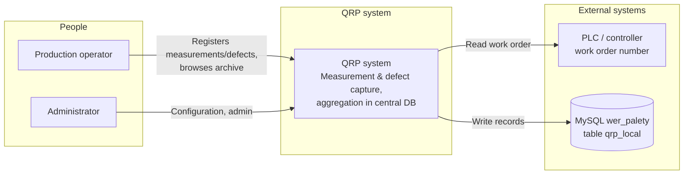
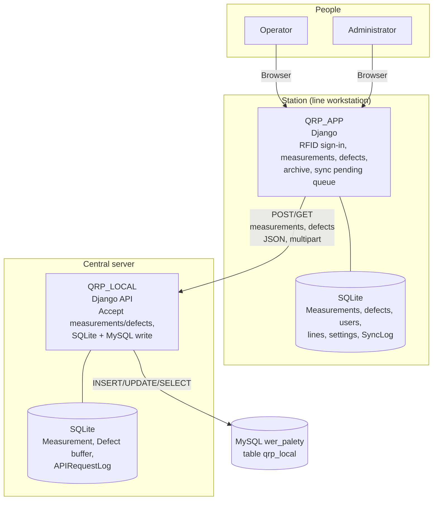

# QRP system documentation – station recorder (QRP_APP) and central server (QRP_LOCAL)

Reference for how both applications work, plus C4-style diagrams (system context, containers).

---

## 1. System overview

The system consists of:

- **QRP_APP (station recorder)** – Django app running on production-line workstations. Operators sign in (RFID or manually), register measurements and defects, and browse the archive. Data is stored locally in SQLite and sent to the central server.
- **QRP_LOCAL (central server)** – Django app that receives data from recorders via API, stores it in local SQLite and in an external MySQL database (e.g. `wer_palety`, table `qrp_local`) for other systems (reporting, integrations).

Data flow: **Recorder (SQLite) → HTTP API → QRP_LOCAL (SQLite + MySQL)**.

---

## 2. QRP_APP (station recorder) – behaviour

### 2.1 Purpose

- Operator sign-in (RFID or registration with KJ number).
- **Measurement** registration (line, control type, test type, photo, comment, work order number).
- **Defect** registration (line, control type, defect description, photo, comment, work order number).
- Archive with filters and CSV/PDF export.
- Synchronisation with the central server (pending queue, background retries, verification after errors).

### 2.2 Technology

- **Backend:** Django (Python)
- **Database:** SQLite (`USE_TZ=False` – local machine time)
- **Frontend:** HTML templates + JavaScript (fetch, forms)

### 2.3 Main components

| Component | Description |
|-----------|-------------|
| **views.py** | Page views (sign-in, measurement, defect, archive, help) and API endpoints (measurement, defect, sync, order-number, auto-logout). |
| **models.py** | Registrar, production line, Measurement, Defect, User/RFIDCard, control type, test type, SystemSettings, SyncLog, AllowedIP, etc. |
| **sync_service.py** | Build payload and POST Measurement/Defect to QRP_LOCAL API; GET verification after timeout/ConnectionError. |
| **sync_scheduler.py** | Daemon thread every N minutes sending unsynchronised measurements and defects, independent of open browser tabs. |
| **csv_service.py** | Generate measurement CSV files (format for an external application). |
| **apps.py** | Start sync scheduler and load AllowedIP into ALLOWED_HOSTS. |
| **middleware.py** | Line selection by hostname/DNS; access restriction by AllowedIP. |

### 2.4 Endpoints (QRP_APP)

| Method | Path | Description |
|--------|------|-------------|
| GET | `/` | RFID sign-in page. |
| POST | `/api/login/` | Sign-in (`rfid_code`). |
| POST | `/api/register/` | RFID card registration (`rfid_code`, `name`, `kj_number`). |
| GET | `/api/order-number/?line_id=<id>` | Read work order number from PLC for a line. |
| POST | `/api/measurement/` | Save measurement (form + optional photo); after save calls `send_to_central_api(pomiar)`. |
| POST | `/api/defect/` | Save defect (form + optional photo); after save calls `send_to_central_api(wada)`. |
| POST | `/logout/` | Sign-out (CSRF from cookie). |
| GET | `/measurement/`, `/defect/`, `/archive/`, `/help/` | Registration and archive pages. |
| GET | `/api/sync/status/` | Last synchronisation status (for UI indicator). |
| GET | `/api/sync/pending/` | List of records in the pending queue (not sent). |
| POST | `/api/sync/now/` | Manually trigger pending-queue synchronisation. |
| GET | `/api/auto-logout-settings/` | Auto sign-out settings (timeout in minutes). |

### 2.5 Synchronisation with QRP_LOCAL

- **When:** Immediately after saving a measurement/defect in the view, and periodically from the scheduler (every `retry_interval_minutes` from SystemSettings).
- **Payload:** JSON (or multipart with `data` field + `photo` file): `record_id`, `registrar_id`, `line_name`, `line_id`, `control_type`, `created_at` (recorder local time in ISO), and for measurements: `test_type` / `test_type_display` / `comment`, for defects: `defect_description` / `comment`.
- **Success:** HTTP 2xx → record marked `is_synced=True`, `synced_at=now()`.
- **Error (timeout/ConnectionError):** GET `/api/measurements/<id>/` or `/api/defects/<id>/` and match on `(record_id, registrar_id)`; if the record exists on the server, local `is_synced=True` is set.
- **Pending queue:** Records with `is_synced=False` appear in the archive under “pending” and are retried by the scheduler.

### 2.6 Configuration (SystemSettings)

- `api_url` – base URL of QRP_LOCAL API (e.g. `http://10.11.1.1:8000/api`).
- `api_token` – Bearer token (optional).
- `retry_interval_minutes`, `retry_batch_size` – scheduler and batch size.
- `show_sync_status`, `show_sync_column` – show sync status and “sent” column in archive.
- `auto_logout_enabled`, `auto_logout_timeout_minutes` – idle auto sign-out.

### 2.7 Time handling

- `USE_TZ=False`: SQLite stores the computer’s local time (`Europe/Warsaw` from settings). `created_at` sent to the API uses the same local time (e.g. `2026-02-21T23:00:00`).

---

## 3. QRP_LOCAL (central server) – behaviour

### 3.1 Purpose

- Accept measurements and defects from recorders via HTTP API.
- Store in local SQLite (Measurement, Defect models – buffer, logs).
- Store in external MySQL (`qrp_local` in e.g. `wer_palety`) for downstream systems.
- Verify MySQL write (read-back by `record_id` + `registrar_id` after commit).
- Return HTTP 503 when MySQL write fails so the recorder can retry.

### 3.2 Technology

- **Backend:** Django (Python)
- **Databases:** SQLite (default, `USE_TZ=False`), MySQL (`external` connection – e.g. wer_palety)
- **API:** JSON, multipart/form-data (photos)

### 3.3 Main components

| Component | Description |
|-----------|-------------|
| **api/views.py** | MeasurementAPI, DefectAPI (POST), MeasurementCheckAPI, DefectCheckAPI (GET), health_check; parse `created_at`, save to models and MySQL. |
| **api/external_db.py** | `save_to_external_db(record_type, data, photo_path)` – INSERT/UPDATE in `qrp_local`, photos as BLOB; after commit, SELECT verification; `created_at` matches recorder time in MySQL. |
| **api/models.py** | Measurement, Defect (`record_id`, `registrar_id`, `line_name`, `line_id`, …), SyncSettings, APIRequestLog. |
| **api/middleware.py** | Catch database connection errors, return 503 for `/api/`. |

### 3.4 Endpoints (QRP_LOCAL)

| Method | Path | Description |
|--------|------|-------------|
| POST | `/api/measurements/` | Accept measurement; save to SQLite (Measurement) and MySQL (`qrp_local`); return 201 or 503 on MySQL error. |
| POST | `/api/defects/` | Accept defect; save to SQLite (Defect) and MySQL (`qrp_local`); return 201 or 503. |
| GET | `/api/measurements/<record_id>/` | List measurements with `record_id` ≤ given id (SQLite + MySQL), match on `(record_id, registrar_id)`. |
| GET | `/api/defects/<record_id>/` | List defects with `record_id` ≤ given id (SQLite + MySQL). |
| GET | `/api/health/` | Health check (status, timestamp). |

### 3.5 MySQL write (`qrp_local`)

- **Table:** `qrp_local` (external database, e.g. wer_palety).
- **Columns:** record_type, record_id, registrar_id, line_name, line_id, user, order_number, control_type, test_type / test_type_display or defect_description, comment, photo (BLOB), created_at, received_at.
- **created_at:** Same wall-clock time as on the recorder (naive local time); no UTC conversion.
- **received_at:** Set to the same value as `created_at` (column populated; success verified by SELECT after write).
- **Verification:** After `commit()`, `SELECT id FROM qrp_local WHERE record_id=? AND record_type=? AND registrar_id=?`; if no row, function returns None (API returns 503).

### 3.6 Registrar and record identity

- **registrar_id** – from payload (recorder sends registrar name or hostname/IP).
- **record_id** – primary key of the record in the recorder database (Measurement.id / Defect.id).
- Uniqueness in MySQL and local SQLite: tuple `(record_id, registrar_id)` plus `record_type`.

### 3.7 Time handling

- `USE_TZ=False`: SQLite stores local time; `created_at` from the API is converted to naive local (`_created_at_naive_local`) and stored in the model and passed to MySQL so the external database shows the same time as the recorder.

---

## 4. Data flow (short)

1. Operator saves a measurement/defect on the recorder → SQLite on QRP_APP, `created_at` = local time.
2. Recorder calls `send_to_central_api(instance)` → POST to QRP_LOCAL `/api/measurements/` or `/api/defects/` with payload (including ISO `created_at`).
3. QRP_LOCAL: parse `created_at` → save to local Measurement/Defect (SQLite) with same wall time → `save_to_external_db()` → INSERT/UPDATE `qrp_local` (MySQL) with same `created_at` → SELECT verification → commit.
4. On 2xx the recorder sets `is_synced=True`. On 503 the record stays in the pending queue and is retried later (scheduler or manual).

---

## 5. C4 – system context diagram

Shows the “QRP” system and external actors/systems.

**Option A – C4 (Mermaid C4 extension):**  
If your renderer supports Mermaid C4, you can use C4Context/C4Container. Below is **plain Mermaid** that renders on GitHub/GitLab/VS Code:

**System context (flowchart):**

---

## 6. C4 – container diagram

Shows containers inside QRP: station recorder (QRP_APP) and central server (QRP_LOCAL) plus databases.

**Container descriptions:**

| Container | Technology | Responsibility |
|-----------|------------|----------------|
| **QRP_APP** | Django | Web app on the recorder: RFID sign-in, measurements and defects, archive, pending queue, sync scheduler. |
| **SQLite (recorder)** | SQLite | Local DB: Measurement, Defect, User, RFIDCard, production line, Registrar, SystemSettings, SyncLog. |
| **QRP_LOCAL** | Django | HTTP API: POST measurements/defects, write to local SQLite and external MySQL, GET for record verification. |
| **SQLite (server)** | SQLite | Buffer DB: Measurement, Defect (API models), APIRequestLog, SyncSettings. |
| **MySQL (wer_palety)** | MySQL | External DB: `qrp_local` table for reporting and integrations. |

---

## 7. Glossary

| Term | Meaning |
|------|---------|
| **record_id** | Primary key of the record (Measurement.id or Defect.id) on the recorder; sent to the API and stored in MySQL. |
| **registrar_id** | Recorder identifier (name from admin or hostname/IP); distinguishes records from different recorders that may share the same `record_id`. |
| **line_id** | Production line id (`LiniaProdukcyjna.id`) on the recorder; in MySQL stored as a reference number. |
| **Pending queue** | Records with `is_synced=False` on the recorder; shown in the archive and retried by the scheduler. |
| **created_at** | Record creation time on the recorder; the same wall time is propagated (recorder → QRP_LOCAL → MySQL) as local time. |

---

## 8. Key file paths

**QRP_APP (recorder):**

- `qrp_project/settings.py` – `TIME_ZONE`, `USE_TZ=False`
- `qrp_app/views.py` – views and API (measurement, defect, sync, archive)
- `qrp_app/models.py` – Measurement, Defect, Registrar, production line, SystemSettings, SyncLog
- `qrp_app/sync_service.py` – `send_to_central_api`, `_prepare_data`, `_prepare_files`
- `qrp_app/sync_scheduler.py` – `start_sync_scheduler`, pending-queue send loop
- `qrp_app/urls.py` – URL routing

**QRP_LOCAL (central server):**

- `local_project/local_project/settings.py` – `TIME_ZONE`, `USE_TZ=False`, `DATABASES` (default + external)
- `local_project/api/views.py` – MeasurementAPI, DefectAPI, MeasurementCheckAPI, DefectCheckAPI
- `local_project/api/external_db.py` – `save_to_external_db`, `_to_naive_local`, post-write verification
- `local_project/api/models.py` – Measurement, Defect, APIRequestLog
- `local_project/api/urls.py` – `/api/measurements/`, `/api/defects/`, `/api/health/`

---

*Documentation for the QRP system. Mermaid diagrams render on GitHub, GitLab, Notion, or Mermaid Live.*
